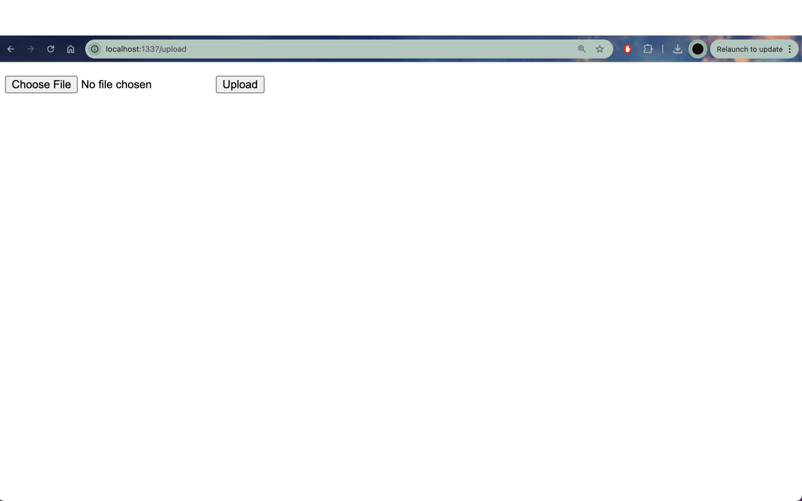

# Flask on Docker

## Overview
This repository contains a containerized Flask web application that integrates with PostgreSQL, Gunicorn, and Nginx.
The project follows a structured microservices architecture to provide a robust and scalable web service via this [tutorial](https://testdriven.io/blog/dockerizing-flask-with-postgres-gunicorn-and-nginx/).
The application includes an image upload feature, which is demonstrated in the gif below.

## Screenshot


For full credit, ensure that this is an animated GIF showing the process of uploading an image.

---

## Build Instructions
To set up and run the Flask application within Docker, follow these steps:

1. **Clone the Repository:**
   ```sh
   git clone https://github.com/your-username/flask-on-docker.git
   cd flask-on-docker
   ```

2. **Connect to the Remote Server:**
   Open a terminal and SSH into the server:
   ```sh
   ssh <username>@lambda.compute.cmc.edu -p 5055
   ```

3. **Build and Start Services:**
   Run the following command to build and start the Docker containers:
   ```sh
   $ docker compose -f docker-compose.prod.yml up -d --build
   $ docker compose -f docker-compose.prod.yml exec web python manage.py create_db
   ```

4. **Enable Port Forwarding:**
   In a second terminal window, run:
   ```sh
   ssh <username>@lambda.compute.cmc.edu -p 5055 -L localhost:1337:localhost:1437
   ```

5. **Access the Web App:**
   Open a web browser and go to:
   ```
   http://localhost:1337/upload
   ```
   This will bring up the image upload interface.

6. **View the image**
   Then to view the image go to:
   ```
   http://localhost:1337/media/IMAGE_FILE_NAME.
   ```
   This will display the image that you uploaded. 


